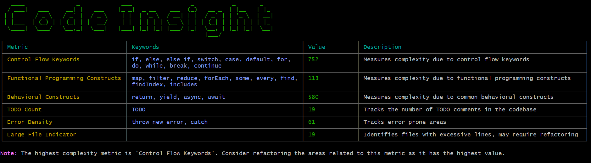

# Codebase Health Tracker [](https://npmjs.com/package/code-insight) [](https://npmjs.com/package/code-insight) [](https://github.com/dwyl/esta/issues)

A Node.js module for analyzing code quality and complexity metrics across your codebase. This tool helps in monitoring code health by calculating various metrics, including complexity due to control flow, functional and behavioral constructs, TODO comments, error density, and code debt ratio.

- [Features](#features)
- [Technologies Used](#technologies-used)
- [Project Structure](#project-structure)
- [Installation and Usage](#installation-and-usage)
- [Benefits](#benefits)
- [Dashboard View](#dashboard-view)

## Features

- **Control Flow Complexity**: Measures complexity based on control flow keywords like `if`, `for`, `while`, etc.
- **Functional Complexity**: Evaluates complexity due to functional programming constructs.
- **Behavioral Complexity**: Assesses complexity arising from behavioral constructs.
- **TODO Comments**: Counts the number of TODO comments in the codebase.
- **Error Density**: Tracks the frequency of error-handling constructs.
- **Code Debt Ratio**: Identifies if the codebase exceeds a certain number of lines, indicating potential code debt.

## Technologies Used

- Node.js
- TypeScript
- [chalk](https://www.npmjs.com/package/chalk) for terminal colors
- [cli-table3](https://www.npmjs.com/package/cli-table3) for tabular data display
- [fs](https://nodejs.org/api/fs.html) and [path](https://nodejs.org/api/path.html) modules for file system operations

## Project Structure

```plaintext
codebase-health-tracker/
├── src
│   ├── bin
│   │   └── cli.ts
│   ├── index.ts
│   └── insighter.ts
├── package.json
├── tsconfig.json
├── .gitignore
├── .npmignore
├── LICENSE
├── pnpm-lock.yaml│
└── README.md
```

### Directory and File Explanations

- **Control Flow Complexity**: Measures complexity based on control flow keywords like `if`, `for`, `while`, etc.
- **Functional Complexity**: Evaluates complexity due to functional programming constructs.
- **Behavioral Complexity**: Assesses complexity arising from behavioral constructs.
- **TODO Comments**: Counts the number of TODO comments in the codebase.
- **Error Density**: Tracks the frequency of error-handling constructs.
- **Large File Indicator**: Identifies if the codebase exceeds a certain number of lines, indicating potential code debt.

## Technologies Used

- Node.js
- TypeScript
- [chalk](https://www.npmjs.com/package/chalk) for terminal colors
- [cli-table3](https://www.npmjs.com/package/cli-table3) for tabular data display
- [fs](https://nodejs.org/api/fs.html) and [path](https://nodejs.org/api/path.html) modules for file system operations

## Installation and Usage

1.  **Global Use:**

    ```bash
    npm install -g code-insight
    ```

    use it in any javascript/typescript project directory from command line

    ```bash
    code-insight directory-path
    ```

2.  **ECMAScript Module Use:**

    install in any javascript/typescript project

    ```bash
    npm install code-insight
    ```

    use it in any app/main/index (application root file)

    ```javascript
    import { generateReport } from "code-insight";

    // Test the generateReport function
    const directoryPath = "src"; // Replace with an actual directory path if needed

    generateReport(directoryPath);
    ```

3.  **CommonJS Module Use:**

    install in any javascript/typescript project

    ```bash
    npm install code-insight
    ```

    use it in any app/main/index (application root file)

    ```javascript
    // Dynamically import the ESM module
    (async () => {
      const { generateReport } = await import("code-insight");
      generateReport("src"); // set directory path here
    })();

    OR;

    const path = require("path");
    // Define the directory path
    const directoryPath = path.join(__dirname, "src");
    // Dynamically import the ESM module
    (async () => {
      const { generateReport } = await import("code-insight");
      generateReport(directoryPath);
    })();
    ```

## Benefits

- **Improved Code Quality**: Provides detailed insights into different aspects of code complexity, enabling developers to write cleaner, more maintainable code.
- **Enhanced Maintainability**: Facilitates identification and management of complex code structures, TODO comments, and error-handling practices to improve overall maintainability.
- **Better Project Management**: Offers actionable insights for managing TODO comments and code debt, aiding in effective project planning and tracking.
- **Performance Optimization**: Helps identify complex constructs that could impact performance, allowing for targeted optimizations.

## Dashboard View




## Thank You! ❤️

